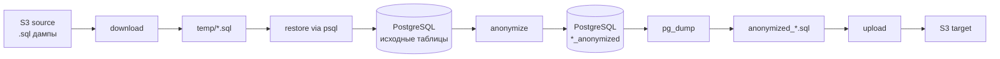
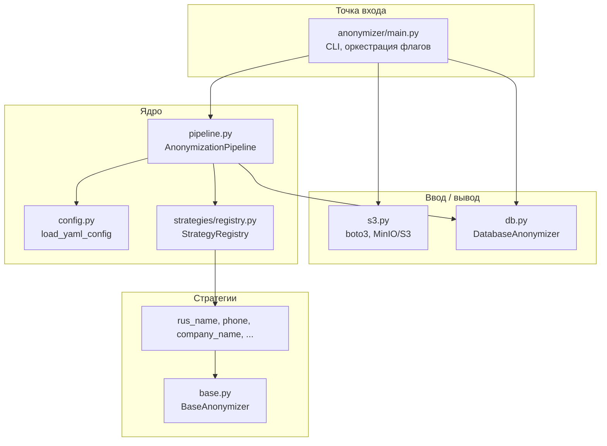
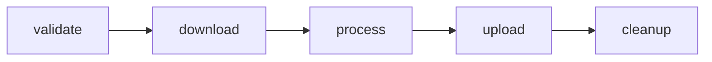

# DB Anonymizer

Конвейер анонимизации продуктивной базы PostgreSQL. Инструмент загружает SQL-дампы из S3-совместимого хранилища, восстанавливает их в PostgreSQL, заменяет персональные и коммерческие поля по YAML-конфигурации и выгружает обезличенный дамп обратно в S3.

Целевой сценарий — подготовка тестовых и стендовых копий БД в GitLab CI/CD без передачи реальных ФИО, телефонов, email, ИНН и названий контрагентов.

Исходные таблицы **не изменяются**. Результат пишется в соседние таблицы с суффиксом `_anonymized`.

---

## Содержание

- [Задачи, которые решает инструмент](#задачи-которые-решает-инструмент)
- [Как устроен конвейер](#как-устроен-конвейер)
- [Архитектура](#архитектура)
- [Структура репозитория](#структура-репозитория)
- [Требования](#требования)
- [Переменные окружения](#переменные-окружения)
- [YAML-конфигурация](#yaml-конфигурация)
- [Каталог стратегий](#каталог-стратегий)
- [Детерминизм](#детерминизм)
- [Локальный запуск](#локальный-запуск)
- [GitLab CI/CD](#gitlab-cicd)
- [Добавление новой стратегии](#добавление-новой-стратегии)
- [Тесты](#тесты)
- [Ограничения и известные особенности](#ограничения-и-известные-особенности)
- [Устранение неполадок](#устранение-неполадок)

---

## Задачи, которые решает инструмент

1. **Изоляция продуктивных данных.** Прод-дамп не копируется на стенды как есть: чувствительные колонки подменяются синтетическими значениями из словарей или генераторов.
2. **Повторяемость.** Одинаковые исходные значения в рамках одного запуска получают одинаковую замену. Это сохраняет логические связи между таблицами (например, одно и то же имя в `users` и `customer_contacts`).
3. **Конфигурация без правки кода.** Список таблиц, колонок и алгоритмов задаётся в `config/anonymization.yaml`. Добавление нового алгоритма — отдельный класс + регистрация в реестре.
4. **Встраивание в CI.** `.gitlab-ci.yml` закрывает полный цикл: проверка конфига → скачивание дампов → restore → anonymize → `pg_dump` → upload.

Анонимизация идёт **по колонкам**. Не указанные в YAML поля копируются без изменений, включая первичные ключи и технические идентификаторы.

---

## Как устроен конвейер



Этапы независимы и включаются флагами CLI. Типовой полный прогон:

```bash
python -m anonymizer.main \
  --download \
  --anonymize \
  --dump \
  --upload \
  --config config/anonymization.yaml
```

`--download` по умолчанию сразу вызывает restore. Чтобы только скачать файлы, добавьте `--no-restore-on-download`.

Порядок в `main.py`:

| Шаг | Флаг | Что происходит |
|-----|------|----------------|
| 1 | `--download` | Все ключи с суффиксом `.sql` из source-бакета скачиваются в `--restore-folder` (по умолчанию `temp/`). Затем, если не указан `--no-restore-on-download`, выполняется restore. |
| 2 | `--restore` | Все `*.sql` из папки применяются через `psql` (в алфавитном порядке). Используется, если дампы уже лежат локально и скачивать ничего не нужно. |
| 3 | `--anonymize` | Для каждой таблицы из YAML создаётся `{table}_anonymized`, данные читаются пакетами и записываются уже обезличенными. |
| 4 | `--dump` | `pg_dump` только таблиц с суффиксом `_anonymized`. |
| 5 | `--upload` | Локальный файл дампа загружается в target-бакет под ключом `anonymized_<YYYYMMDD_HHMMSS>.sql`. |

Если не передан ни один из флагов `--download`, `--restore`, `--anonymize`, `--dump`, `--upload`, процесс завершается с кодом 1.

---

## Архитектура

Код разделён на четыре слоя. Стратегии анонимизации не знают про PostgreSQL и S3; слой БД не знает про YAML.



### `DatabaseAnonymizer` (`anonymizer/db.py`)

Два отдельных соединения psycopg2:

- **read** — серверный курсор (`DECLARE … FETCH`), чтобы не держать всю таблицу в памяти;
- **write** — DDL (`CREATE TABLE … LIKE`, `DROP`) и массовый `INSERT` через `psycopg2.extras.execute_values`.

Restore и dump выполняются не через psycopg2, а через внешние утилиты:

- если задан `POSTGRES_CONTAINER_NAME` и контейнер запущен — `docker exec … psql` / `pg_dump`;
- иначе — локальные `psql` и `pg_dump` с переменными `PGHOST`, `PGPORT`, `PGUSER`, `PGPASSWORD`, `PGDATABASE` (ветка для GitLab CI).

Таймаут выполнения SQL-файла — 1 час. Ошибки вида `already exists` для relation/table/schema при restore логируются как warning и не роняют процесс.

Целевая таблица создаётся как:

```sql
CREATE TABLE "{dst}" (LIKE "{src}" INCLUDING DEFAULTS)
```

Копируются типы колонок и значения по умолчанию. Индексы, ограничения и внешние ключи **не** переносятся.

### `AnonymizationPipeline` (`anonymizer/pipeline.py`)

1. Читает YAML, резолвит относительный путь к конфигу от корня репозитория.
2. Подставляет абсолютные пути словарей вместо символических имён из `settings.dictionaries`.
3. Для каждой таблицы:
   - дропает `{src}_anonymized`, если она уже есть;
   - создаёт её по образцу исходной;
   - читает исходные строки пакетами `settings.batch_size` (в конфиге — 1000, запасной default в коде — 5000);
   - применяет стратегии к указанным колонкам;
   - вставляет пакет в целевую таблицу.
4. Кэширует экземпляры стратегий по паре `(algorithm, params)`, чтобы одна и та же стратегия с одними параметрами переиспользовалась между таблицами.

Колонка, которой нет в строке, или стратегия без поля `algorithm` пропускаются. При исключении внутри `anonymize()` ошибка логируется, в целевую таблицу уходит **исходное** значение колонки.

`NULL` не подменяется: `BaseAnonymizer.anonymize()` возвращает `None` как есть.

### Стратегии (`anonymizer/strategies/`)

Единый контракт — абстрактный `BaseAnonymizer`:

- `_generate(value, row)` — конкретное преобразование;
- `anonymize(value, row)` — обёртка с кэшем «исходное значение → результат» внутри экземпляра.

Реестр `StrategyRegistry` связывает строковое имя из YAML (`rus_name`, `phone`, …) с классом. Регистрация выполняется при импорте пакета `anonymizer.strategies`.

---

## Структура репозитория

```
db-anonimizer/
├── anonymizer/
│   ├── main.py                 # CLI
│   ├── pipeline.py             # оркестрация анонимизации
│   ├── db.py                   # PostgreSQL: restore, batch read, insert, dump
│   ├── s3.py                   # S3/MinIO
│   ├── config.py               # загрузка YAML
│   └── strategies/
│       ├── __init__.py         # импорт и регистрация алгоритмов
│       ├── base.py
│       ├── registry.py
│       ├── rus_name.py
│       ├── rus_surname.py
│       ├── rus_full_name.py
│       ├── email_from_name.py
│       ├── phone.py
│       ├── company_name.py
│       ├── project_name.py
│       ├── random_digit.py     # алгоритм random_digits
│       ├── random_int.py
│       ├── random_words.py
│       ├── random_string.py
│       └── fixed_value.py
├── config/
│   ├── anonymization.yaml      # таблицы, колонки, словари
│   └── dictionaries/           # по одному значению на строку, UTF-8
│       ├── male_names_rus.txt
│       ├── male_surnames_rus.txt
│       ├── rus_full_name_file.txt
│       ├── company_words.txt
│       ├── project_words.txt
│       └── common_words.txt
├── test/
│   ├── for_test_table.sql      # схема и тестовые данные под текущий YAML
│   ├── test_pipeline.py
│   ├── test_db.py
│   └── test_name.py
├── .gitlab-ci.yml
├── docker-compose.yml          # локальные GitLab, MinIO, PostgreSQL, Runner
├── requirements.txt
└── README.md
```

Словари лежат рядом с YAML (`config/dictionaries/`). Пути в `settings.dictionaries` резолвятся **относительно каталога конфига**, не относительно корня репозитория.

---

## Требования

| Компонент | Версия / условие |
|-----------|------------------|
| Python | 3.11+ (образ CI — `python:3.11-slim`) |
| PostgreSQL | 15+ (в CI — `postgres:15-alpine`; локальный compose может быть новее) |
| Клиентские утилиты | `psql`, `pg_dump` — либо на хосте, либо внутри контейнера Postgres |
| S3 | любой S3 API: MinIO, AWS S3, Yandex Object Storage |
| Docker / Compose | для локального стенда GitLab + MinIO + Postgres |
| GitLab Runner | executor с доступом к Docker, тег `docker` |

Зависимости Python (`requirements.txt`): `psycopg2`, `boto3`, `PyYAML`, `python-dotenv`. В CI дополнительно ставится `psycopg2-binary` и пакет `postgresql-client`.

---

## Переменные окружения

Читаются из `.env` в корне проекта (`python-dotenv`) и/или из окружения процесса. Файл `.env` в git не коммитится.

### PostgreSQL

| Переменная | Назначение |
|------------|------------|
| `POSTGRES_HOST` | Хост. Default в коде: `localhost`. В CI: `postgres` (alias service). |
| `POSTGRES_PORT` | Порт. Default: `5432`. |
| `POSTGRES_USER` | Пользователь БД. |
| `POSTGRES_PASSWORD` | Пароль. |
| `POSTGRES_DB` | Имя базы. |
| `POSTGRES_CONTAINER_NAME` | Имя Docker-контейнера Postgres. Если контейнер запущен, restore/dump идут через `docker exec`. В CI оставьте пустым — будет вызван системный `psql`. |

### S3 / MinIO

| Переменная | Назначение |
|------------|------------|
| `ENDPOINT_URL` | Endpoint, например `http://127.0.0.1:9000` или `http://minio:9000` внутри Docker-сети. |
| `MINIO_ROOT_USER` | Access key (`aws_access_key_id`). |
| `MINIO_ROOT_PASSWORD` | Secret key (`aws_secret_access_key`). |

Имена бакетов в код не зашиты: source задаётся `--s3-source` (default `source`), target — `--s3-target` (default `target`). Скачивание всегда идёт из source, загрузка — в target.

Пример `.env` для локального запуска:

```env
POSTGRES_HOST=localhost
POSTGRES_PORT=5432
POSTGRES_USER=admin
POSTGRES_PASSWORD=changeme
POSTGRES_DB=for_test
POSTGRES_CONTAINER_NAME=postgres_container

ENDPOINT_URL=http://127.0.0.1:9000
MINIO_ROOT_USER=admin
MINIO_ROOT_PASSWORD=changeme
```

---

## YAML-конфигурация

Файл по умолчанию: `config/anonymization.yaml`. Путь переопределяется `-c` / `--config`.

### `settings`

```yaml
settings:
  dictionaries:
    names_file: "dictionaries/male_names_rus.txt"
    surnames_file: "dictionaries/male_surnames_rus.txt"
    full_name_file: "dictionaries/rus_full_name_file.txt"
    company_words_file: "dictionaries/company_words.txt"
    project_words_file: "dictionaries/project_words.txt"
    common_words_file: "dictionaries/common_words.txt"
  batch_size: 1000
```

Ключ в `dictionaries` — символическое имя. Если параметр стратегии совпадает с этим именем (например `source: "names_file"`), пайплайн подставит абсолютный путь к файлу.

`batch_size` — размер пакета чтения/записи. Для крупных таблиц имеет смысл держать 1000–5000: меньше пиков памяти, больше записей в лог прогресса.

Секция `algorithms` в YAML — справочник для человека. Реестр стратегий заполняется кодом в `strategies/__init__.py`, а не этим списком.

### `tables`

```yaml
tables:
  users:
    columns:
      first_name:
        algorithm: rus_name
        params:
          source: "names_file"
      last_name:
        algorithm: rus_surname
        params:
          source: "surnames_file"
      email:
        algorithm: email_from_name
        params:
          domain: "example.com"
```

Правила:

- ключ верхнего уровня — **имя таблицы в PostgreSQL** (схема `public`);
- внутри `columns` — только те поля, которые нужно заменить;
- `algorithm` должен быть зарегистрирован, иначе `StrategyRegistry.get()` бросит `KeyError` со списком доступных имён;
- `params` опционален; неизвестные ключи стратегия просто игнорирует.

Текущий конфиг покрывает таблицы `users`, `customer_contacts`, `customers`, `projects`, `companies_btx`. Соответствующая схема и тестовые INSERT лежат в `test/for_test_table.sql`.

---

## Каталог стратегий

Все генераторы детерминированы: seed строится из `hash(исходного значения)` либо индекс в словаре берётся как `abs(hash(value)) % len(dict)`.

| Имя в YAML | Класс | Что делает | Параметры |
|------------|-------|------------|-----------|
| `rus_name` | `RusNameAnonymized` | Имя из словаря | `source` — путь или алиас словаря |
| `rus_surname` | `RusSurnameAnonymized` | Фамилия из словаря | `source` |
| `rus_full_name` | `RusFullNameAnonymized` | Строка ФИО целиком из словаря | `source` |
| `email_from_name` | `EmailAnonymized` | Случайный local-part 8–12 символов (`[a-z0-9]`) + домен | `domain` (default `example.com`) |
| `phone` | `RusPhoneAnonymized` | Маска: символы `X`/`x` заменяются цифрами, остальное копируется | `phone_mask` (default `+7XXX XXX XX XX`) |
| `company_name` | `CompanyNameAnonymized` | 1–N слов из словаря компаний | `words_source`, `min_words` (1), `max_words` (3), `preserve_length` (false), `separator` (`" "`) |
| `project_name` | `ProjectNameAnonymized` | То же для названий проектов | `words_source`, `min_words` (1), `max_words` (5), `preserve_length`, `separator` |
| `random_digits` | `RandomDigitsAnonymized` | Строка из N цифр | `length` (default 5) |
| `random_int` | `RandomIntAnonymized` | Целое в диапазоне | `min` (0), `max` (1_000_000) |
| `random_words` | `RandomWordsAnonymized` | **Одно** слово из словаря | `source` |
| `random_string` | `RandomStringAnonymized` | Латиница + цифры | `length` (10), `preserve_length` (false) |
| `fixed_value` | `FixedValueAnonymized` | Константа | `value` (default `""`) |

`preserve_length` у `company_name` / `project_name` не обрезает строку, а перебирает число слов в `[min_words, max_words]` и выбирает кандидата с длиной, ближайшей к исходной.

Поставляемые словари (число непустых строк):

| Файл | Записей | Назначение |
|------|---------|------------|
| `male_names_rus.txt` | ~736 | Русские имена |
| `male_surnames_rus.txt` | ~14 650 | Русские фамилии |
| `rus_full_name_file.txt` | ~163 | Готовые ФИО |
| `company_words.txt` | ~185 | Корни/слова для юрлиц |
| `project_words.txt` | ~186 | Слова для названий проектов |
| `common_words.txt` | ~512 | Общий словарь (`random_words`) |

Формат словаря: UTF-8, одно значение на строку, пустые строки отбрасываются.

---

## Детерминизм

Внутри **одного процесса** выполняются три механизма:

1. `hash(value)` как seed генератора / индекс словаря.
2. Кэш `_cache` в `BaseAnonymizer`: повтор того же исходного значения не вызывает `_generate`.
3. Кэш экземпляров стратегий в пайплайне: одинаковые `(algorithm, params)` на разных таблицах — один объект, общий `_cache`.

Следствия:

- «Иван» в `users.first_name` и «Иван» в другой таблице с тем же `rus_name` + тем же словарём станут одним и тем же именем.
- `NULL` остаётся `NULL` и в кэш не попадает.
- Разные алгоритмы или разные словари для одного текста дают разные результаты — это ожидаемо.

Ограничение Python: `hash()` для строк **солится при старте интерпретатора** (`PYTHONHASHSEED`). Поэтому детерминизм гарантирован внутри запуска, но **не между двумя независимыми процессами**, пока явно не зафиксирован seed:

```bash
export PYTHONHASHSEED=0
python -m anonymizer.main --anonymize
```

В CI, если нужна стабильная замена от пайплайна к пайплайну, задайте `PYTHONHASHSEED` в `variables`.

---

## Локальный запуск

### 1. Инфраструктура

`docker-compose.yml` поднимает стенд для отладки CI, а не сам анонимайзер:

- PostgreSQL (`postgres_container`, порт 5432);
- MinIO (API 9000, консоль 9001);
- GitLab CE и GitLab Runner.

```bash
docker compose up -d db minio
```

Создайте бакеты `source` и `target` в консоли MinIO (`http://localhost:9001`) и положите в `source` один или несколько `.sql`.

### 2. Python-окружение

```bash
python3.11 -m venv .venv
source .venv/bin/activate
pip install -r requirements.txt
```

Положите `.env` в корень (см. таблицу переменных выше).

### 3. Данные

Минимальный путь без S3 — восстановить тестовую схему и сразу анонимизировать:

```bash
mkdir -p temp
cp test/for_test_table.sql temp/
python -m anonymizer.main --restore --restore-folder temp/
python -m anonymizer.main --anonymize
python -m anonymizer.main --dump --dump-name anonymized_backup.sql
```

Полный цикл, как в CI:

```bash
python -m anonymizer.main --download --anonymize --dump --upload \
  --s3-source source \
  --s3-target target \
  --dump-name anonymized_backup.sql
```

Справка по флагам: `python -m anonymizer.main --help`.

| Флаг | Default | Смысл |
|------|---------|--------|
| `-c`, `--config` | `config/anonymization.yaml` | Путь к YAML |
| `-d`, `--download` | off | Скачать `*.sql` из source |
| `--no-restore-on-download` | off | Не делать restore после download |
| `-r`, `--restore` | off | Восстановить из локальной папки |
| `--restore-folder` | `temp/` | Папка с дампами |
| `-a`, `--anonymize` | off | Запустить пайплайн |
| `--dump` | off | Снять `pg_dump` таблиц `*_anonymized` |
| `--dump-name` | `anonymized_backup.sql` | Имя локального файла дампа |
| `-u`, `--upload` | off | Загрузить дамп в target |
| `--s3-source` | `source` | Имя source-бакета |
| `--s3-target` | `target` | Имя target-бакета |

Запуск модулем (`python -m anonymizer.main`) — предпочтительный способ: так отрабатывают относительные импорты пакета.

---

## GitLab CI/CD

Файл `.gitlab-ci.yml`. Образ джоб — `python:3.11-slim`, тег раннера — `docker`. Стадии:



| Джоба | Стадия | Действие |
|-------|--------|----------|
| `validate:config` | validate | Файл конфига существует, YAML парсится, секция `tables` непуста, заданы обязательные env. |
| `download:dumps` | download | `--download --no-restore-on-download`. Артефакт — каталог `temp/`, TTL 2 часа. Падает, если не скачано ни одного `.sql`. |
| `process:database` | process | Service `postgres:15-alpine`. Restore → anonymize → dump. Артефакт — `anonymized_${CI_PIPELINE_ID}.sql`, TTL 24 часа. |
| `upload:dump` | upload | `--upload` в target-бакет. |
| `cleanup` | cleanup | `when: always`, удаление `temp/`. |

Переменные, которые CI ожидает в GitLab (Settings → CI/CD → Variables) либо в `variables:` пайплайна:

- `POSTGRES_USER`, `POSTGRES_PASSWORD`, `POSTGRES_DB`
- `MINIO_ROOT_USER`, `MINIO_ROOT_PASSWORD`, `ENDPOINT_URL`

`POSTGRES_HOST` в пайплайне задан как `postgres` — это alias Docker-service, не хост раннера.

`download` и `upload` ходят в S3 **с раннера**. Endpoint должен быть достижим из сети GitLab Runner (в docker-compose это общая сеть `gitlab-network`).

---

## Добавление новой стратегии

Основной код пайплайна, загрузчика YAML и слоя БД менять не нужно.

**1.** Файл `anonymizer/strategies/my_strategy.py`:

```python
from typing import Any, Dict, Optional
from anonymizer.strategies.base import BaseAnonymizer


class MyStrategy(BaseAnonymizer):
    def _generate(self, value: Any, row: Optional[Dict] = None) -> Any:
        prefix = self.params.get("prefix", "anon")
        return f"{prefix}-{value}"
```

`row` — полная исходная строка таблицы (словарь колонка → значение). Нужен, если замена зависит от соседних полей.

**2.** Регистрация в `anonymizer/strategies/__init__.py`:

```python
from .my_strategy import MyStrategy
StrategyRegistry.register("my_algorithm", MyStrategy)
```

**3.** Использование в `config/anonymization.yaml`:

```yaml
tables:
  some_table:
    columns:
      some_column:
        algorithm: my_algorithm
        params:
          prefix: "x"
```

Если стратегия читает словарь, принимайте алиас (`source: "names_file"`) — пайплайн сам подставит абсолютный путь, если имя есть в `settings.dictionaries`.

Не переопределяйте `anonymize()`, если не нужно обойти кэш: детерминизм и обработка `NULL` уже живут в базе.

---

## Тесты

Это не pytest-сюита, а рабочие скрипты против живой БД.

| Файл | Назначение |
|------|------------|
| `test/for_test_table.sql` | DDL + INSERT под текущий `anonymization.yaml` |
| `test/test_db.py` | Подключение, `INSERT`, `fetch_all`, `fetch_batch` |
| `test/test_pipeline.py` | Прогон пайплайна и сравнение `users` / `users_anonymized` |
| `test/test_name.py` | Черновик проверки реестра |

Перед прогоном БД должна быть доступна, `.env` заполнен.

```bash
python test/test_db.py
python -m anonymizer.main --restore --restore-folder test/   # если положить sql в test/ либо скопировать в temp/
python test/test_pipeline.py
```

Критерий в `test_pipeline.py`: хотя бы одно из полей `first_name` / `last_name` / `email` отличается от оригинала. После проверки скрипт дропает `users` и `users_anonymized`.

---

## Ограничения и известные особенности

Документируется фактическое поведение кода, а не пожелания из YAML-комментариев.

1. **Исходные таблицы read-only для пайплайна**, но restore из прод-дампа перезаписывает содержимое рабочей БД. Для CI используется отдельный эфемерный Postgres; локально не направляйте инструмент на прод.
2. **`*_anonymized` без индексов и FK.** `CREATE TABLE … LIKE … INCLUDING DEFAULTS` не копирует constraints. Дамп пригоден как набор данных, а не как полная физическая копия схемы.
3. **Дамп содержит только `*_anonymized`.** Таблицы, не перечисленные в YAML, в выходной SQL не попадут. Если стенду нужна полная схема, их нужно добавлять в конфиг (хотя бы с пустым `columns: {}` — тогда таблица скопируется as-is) либо снимать дамп отдельно.
4. **`email_from_name` не строит адрес из ФИО.** Генерируется случайный local-part. Параметр `use_transliterate` в YAML **игнорируется**, транслитерация по ГОСТ 7.79-2000 не реализована. Алгоритм `random_email` упомянут в справочной секции YAML, но в реестре отсутствует.
5. **`random_words` возвращает одно слово**, а не последовательность. Параметров `min_words` / `max_words` у этой стратегии нет — они есть у `company_name` и `project_name`.
6. **Кэш и `hash()` не переживают процесс.** См. раздел [Детерминизм](#детерминизм).
7. **Имена таблиц без схемы.** Пайплайн работает с `public` и подставляет идентификаторы в двойных кавычках. Схемы кроме `public` и mixed-case имена нужно проверять отдельно.
8. **Restore игнорирует `already exists`.** Повторный накат дампа, который создаёт схему/таблицы, может частично примениться и оставить смесь старых и новых данных. Для чистого прогона используйте пустую БД (как в CI).
9. **Секреты в репозитории.** В `docker-compose.yml` и `.gitlab-ci.yml` зашиты локальные пароли стенда. Для реального GitLab задавайте переменные в UI и не переиспользуйте стендовые креденшелы.
10. **`dockerfile` в корне** — это команда регистрации GitLab Runner, а не сборка образа приложения.

---

## Устранение неполадок

| Симптом | Что проверить |
|---------|----------------|
| `Не указано действие` | Нужен хотя бы один флаг `--download` / `--restore` / `--anonymize` / `--dump` / `--upload`. |
| `Файл конфигурации не найден` | Путь `-c`. Относительные пути считаются от корня репозитория. |
| `Стратегия '…' не найдена` | Имя в YAML не совпадает с `StrategyRegistry.register(...)`. Сверьтесь с `strategies/__init__.py`. |
| `Не указан параметр 'source'` / `'words_source'` | Алиас не попал в `settings.dictionaries`, либо опечатка в ключе. |
| Ошибка подключения к Postgres | `POSTGRES_HOST/PORT/USER/PASSWORD/DB`, доступность порта 5432, для Docker — имя сервиса vs `localhost`. |
| Restore через `docker exec` не стартует, идёт в локальный `psql` | `POSTGRES_CONTAINER_NAME` пуст или `docker ps` не видит контейнер (нет Docker socket у процесса). |
| `psql завершился с кодом …` | Дамп несовместим с версией сервера, битая кодировка, или ошибка не из класса `already exists`. Смотрите stderr в логе. |
| Нет таблицы `*_anonymized` | Таблица отсутствует в `tables:` либо пайплайн упал раньше (исключение пробрасывается и останавливает `run()`). |
| Ошибка S3 / MinIO | `ENDPOINT_URL` без лишнего слэша-пути, ключи, существование бакетов `source`/`target`, сеть раннера до MinIO. |
| В бакете 0 файлов `.sql` | `list_by_suffix` смотрит только source. Префикс/каталог внутри бакета допустим — фильтр по суффиксу идёт уже по полному ключу, в локальный путь пишется `basename`. |
| Дамп пустой после `--dump` | Нет таблиц `LIKE '%_anonymized'` в `public` — анонимизация не выполнялась или писала в другую БД. |
| Замена «плывёт» между запусками | Не зафиксирован `PYTHONHASHSEED`. |
| Колонка не изменилась, в логе traceback | Стратегия бросила исключение; пайплайн оставил оригинал. Читайте `Ошибка анонимизации колонки`. |

Лог пишется в stdout в формате `%(asctime)s [%(levelname)s] %(name)s: %(message)s`. По каждой таблице печатается список колонок и накопительный счётчик строк.

---

## Лицензия и происхождение

Учебно-производственный проект (КубГТУ): программное средство анонимизации продуктивной БД PostgreSQL для встраивания в CI/CD. Лицензионный файл в репозитории отсутствует — уточняйте условия распространения у владельца репозитория.
